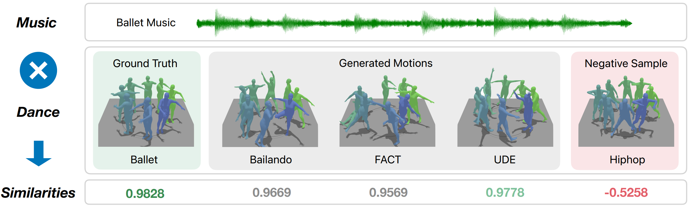
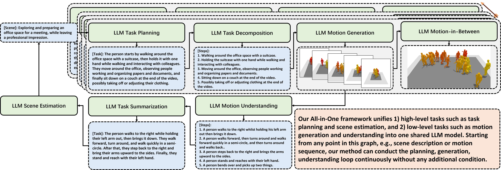
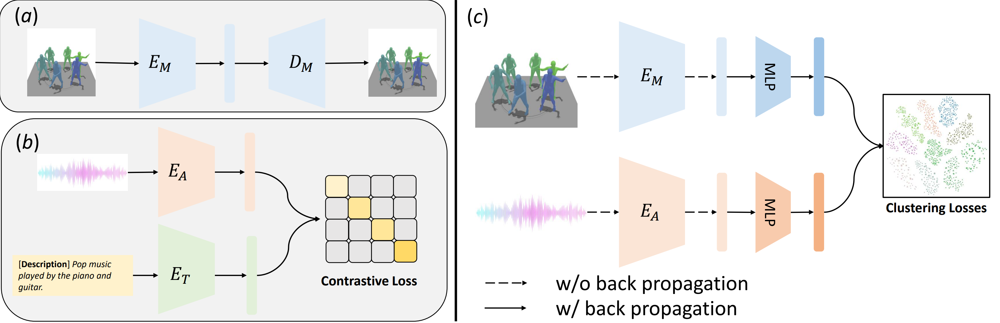

# Official implementation of "MDSC: Towards Evaluating the Style Consistency Between Music and Dance"

### [Arxiv](https://arxiv.org/abs/2309.01340v3) | [Project Website](https://rxlqn.github.io/MDSC/)

---

## Abstract
#### We propose MDSC(Music-Dance-Style Consistency), the first evaluation metric that assesses to what degree the dance moves and music match. Existing metrics can only evaluate the motion fidelity and diversity and the degree of rhythmic matching between music and dance. MDSC measures how stylistically correlated the generated dance motion sequences and the conditioning music sequences are. We found that directly measuring the embedding distance between motion and music is not an optimal solution. We instead tackle this through modeling it as a clustering problem. Specifically, 1) we pre-train a music encoder and a motion encoder, then 2) we learn to map and align the motion and music embedding in joint space by jointly minimizing the intra-cluster distance and maximizing the inter-cluster distance, and 3) for evaluation purposes, we encode the dance moves into embedding and measure the intra-cluster and inter-cluster distances, as well as the ratio between them. We evaluate our metric on the results of several music-conditioned motion generation methods, combined with user study, we found that our proposed metric is a robust evaluation metric in measuring the music-dance style correlation.

## Overview
<!-- 
=== -->

#### (a) We train a motion auto-encoder supervised by reconstruction loss, and use the encoder as $\textit{E}_M$. (b) We use the pretrained music encoder $\textit{E}_A$. (c) Given batch of motion sequence and music streams as input, our method uses pretrained motion encoder $\textit{E}_M$ and music encoder $\textit{E}_A$ to obtain their embedding. Instead of pulling paired motion embedding and audio embedding closer and push unpaired apart, we attempt to cluster style-consistent motion embedding and music embedding into same cluster, while inconsistent embedding are clustered into different clusters. At this stage, only the light-weight MLPs are trainable. The dotted arrow means no back-propagation is applied, while solid arrow means back-propagation is applied.

## Code
#### Coming soon

## Citation
@article{zhou2023mdsc, \
$\qquad$  title={MDSC: Towards Evaluating the Style Consistency Between Music and Dance}, \
$\qquad$  author={Zhou, Zixiang and Li, Weiyuan and Wang, Baoyuan}, \
$\qquad$  journal={arXiv preprint arXiv:2309.01340}, \
$\qquad$  year={2023} \
}